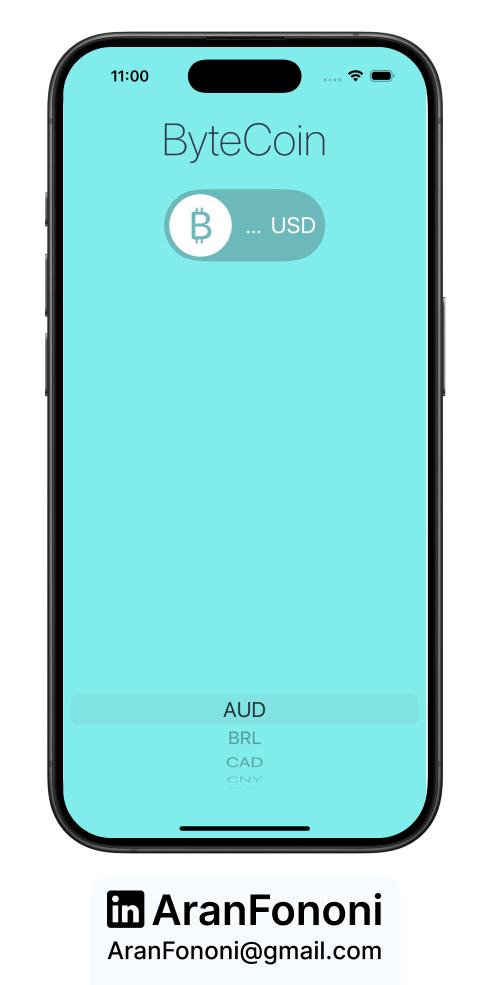
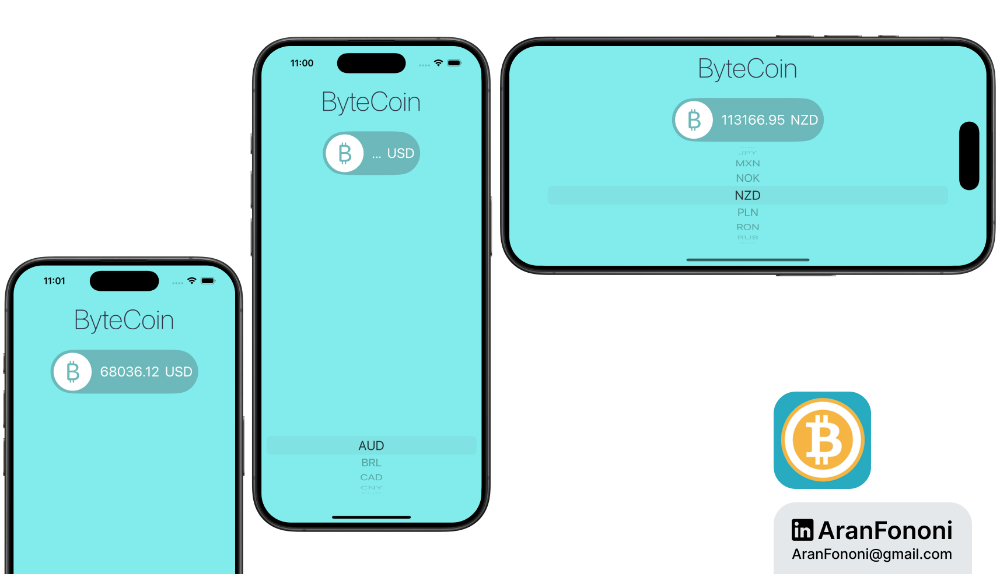

# ByteCoin

### Project for Section 14: **Cryptocurrency Price Tracker**  
This project was completed as part of Section 14 in the **Complete iOS Development Bootcamp** by Angela Yu.

## Project Overview
The **ByteCoin** app allows users to check the current price of Bitcoin in various currencies. By fetching data from the CoinLayer API, the app displays real-time cryptocurrency rates based on user-selected currencies.

## What I Learned
In this project, I focused on:
- **Networking**: Implemented API requests to fetch cryptocurrency data.
- **JSON Parsing**: Learned how to decode JSON responses into Swift structures.
- **Delegate Pattern**: Used protocols and delegates for asynchronous data handling.

## Key Skills
- Proficiency in making network requests and handling JSON with URLSession
- Effective use of the delegate pattern to update the UI based on fetched data
- Understanding of cryptocurrency pricing and market rates

## Additional Features
The app provides a selection of currencies for users to view Bitcoin prices, allowing for a dynamic and user-friendly experience.

---

### Project Preview

---

### Footer

---

## Contact
For more information, feel free to reach out:  
- **Email**: [aranfononi@gmail.com](mailto:aranfononi@gmail.com)  
